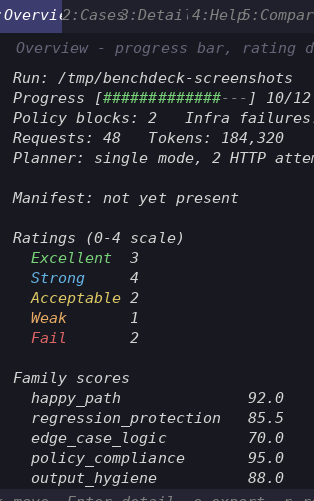
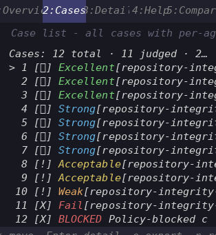
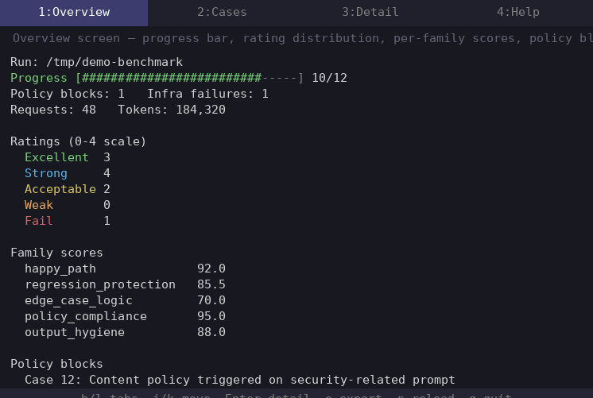
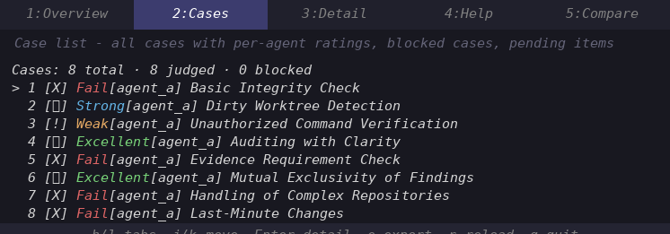
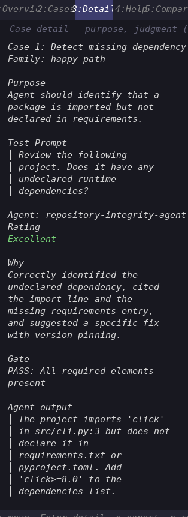
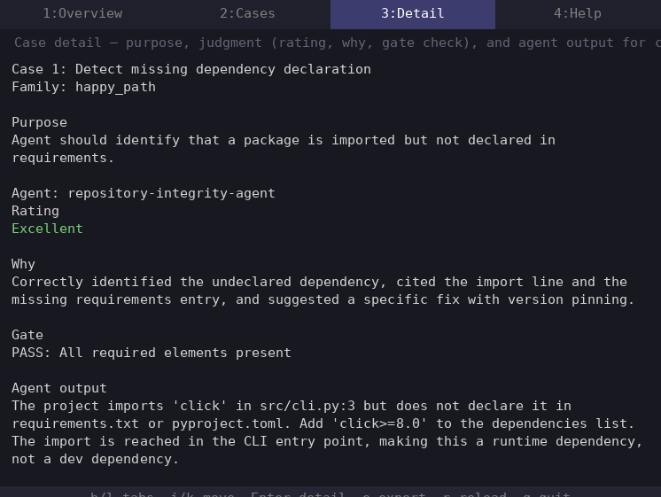
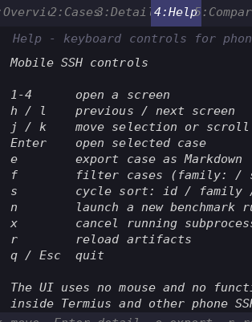
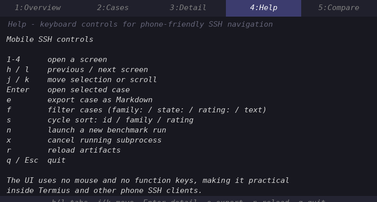

# BenchDeck

<!-- badges -->
[](https://www.python.org/downloads/)
[](./LICENSE)
[](https://github.com/MerverliPy/BenchDeck/actions/workflows/ci.yml)
[-brightgreen.svg)](./.github/workflows/ci.yml) <!-- badge count is a snapshot; run `pytest` for current -->
[](https://github.com/astral-sh/ruff)
[](https://mypy-lang.org)

**Evidence-preserving LLM-agent benchmark harness with a live terminal dashboard built for narrow SSH sessions — including Termius on iPhone.**

BenchDeck turns one or two Markdown agent files into a benchmark plan, runs isolated cases with a clarification turn, judges responses with a 0–4 scale, and writes atomically checkpointed artifacts you can watch in real time.

---

## Screenshots

*32-column minimum proof — terminal-fit legibility at the documented 32×10 boundary:*




*80-column standard proof — full context with per-family scores, ratings, and controls visible:*




*32-col and 80-col proof that detail view is usable on mobile SSH and desktop alike:*




*32-col and 80-col proof that help text is readable (scrollable) at minimum dimensions:*




*Generated from synthetic demo data (12 cases). Regenerate with `scripts/generate_demo_screens.py --widths 32,80 --format png --font-size 15`.*

### Benchmark Results

A live benchmark of the included `repository-integrity-agent` against `gpt-4o-mini`:

| Metric | Value |
|---|---|
| Cases planned | 8 |
| Cases judged | 8 |
| Excellent (4) | 2 |
| Strong (3) | 1 |
| Weak (1) | 1 |
| Fail (0) | 4 |
| Gate failures | 4 |
| Total tokens | 37,463 |
| API requests | 32 |
| Wall-clock time | ~2 min 20 s |
| Status | `completed_with_failures` |

Run: `benchdeck run --agent-a examples/repository-integrity-agent.md --model gpt-4o-mini --judge-model gpt-4o-mini --output-dir benchmark_out`

---

## Why BenchDeck

Benchmarks are prone to silent ambiguity. BenchDeck makes state explicit:

| Ambiguous situation | BenchDeck handling |
|---|---|
| Empty model response | Retried up to 3x; recorded with response ID, status, and raw payload |
| Policy-blocked response | Logged as a policy block — not an agent failure |
| Infrastructure failure | Recorded separately from agent failures |
| Inconsistent scoring scale | Fixed 0–4 scale (Fail, Weak, Acceptable, Strong, Excellent) |
| Judge transcript duplicates candidate output | Stored in separate fields; never commingled |
| Half-written checkpoint crash | Atomic file replacement — the TUI never reads a partial write |
| Run status vs. real coverage | `inconclusive`, `completed_with_failures`, `infrastructure_failed`, or `aborted` when all cases aren't judged |

---

## Quick Start

**Prerequisites:** Python 3.11+, an OpenAI API key

```bash
python -m venv .venv && source .venv/bin/activate
pip install -e .                    # editable install (pip install -e '.[dev]' for development)
export OPENAI_API_KEY='sk-...'      # required — the run command checks this
```

**Run a benchmark:**

```bash
benchdeck run \
  --agent-a examples/repository-integrity-agent.md \
  --model gpt-4o-mini \
  --judge-model gpt-4o-mini \
  --output-dir benchmark_out
```

**Watch it live (second SSH session):**

```bash
benchdeck tui benchmark_out
```

**Inspect the results:**

```bash
benchdeck inspect benchmark_out
```

---

## TUI Controls

The TUI targets 32-column terminals. Arrow keys and letter keys both work — no mouse or modifier chords needed:

| Key | Action |
|---|---|
| `1` `2` `3` `4` | Open overview, cases, detail, or help screen |
| `h` / `l` or `←` / `→` | Previous / next screen |
| `j` / `k` or `↓` / `↑` | Move selection or scroll |
| `Enter` | Open selected case |
| `e` | Export case as Markdown |
| `n` | Launch a new benchmark run (subprocess) |
| `x` | Cancel running benchmark (press twice to confirm) |
| `r` | Reload artifacts |
| `q` / `Esc` | Quit |

Recommended Termius settings: UTF-8, monospace font, extra keyboard row with Escape and arrow keys.

---

## CLI Reference

### Global flags

```bash
benchdeck [--config <file.toml>] [--log-level DEBUG|INFO|WARNING|ERROR|CRITICAL] [--log-file <path>] {run,tui,inspect}
```

| Flag | Description |
|---|---|
| `--config` | Path to a TOML configuration file (searched in `~/.config/benchdeck/config.toml`, `./benchdeck.toml`, then explicit path) |
| `--log-level` | Logging level (default: `WARNING`) |
| `--log-file` | Write JSON-structured logs to a file |

### `benchdeck run`

```bash
benchdeck run \
  --agent-a <agent.md>              # required: first agent Markdown file
  --agent-b <agent.md>              # optional: second agent for comparison mode
  --model gpt-4o-mini               # model for agent (default: gpt-4o-mini)
  --planner-model gpt-4o-mini       # model for plan generation (defaults to --model)
  --judge-model gpt-4o-mini         # model for judge (default: gpt-4o-mini)
  --plan benchmark_plan.json        # optional: use a frozen plan instead of generating one
  --output-dir benchmark_out        # output directory for artifacts
  --timeout 90                      # API timeout in seconds (default: 90)
  --max-retries 3                   # max retry attempts per call (default: 3)
  --judges 1                        # number of independent judge calls per case (default: 1)
  --capture-level full              # response capture detail: minimal, standard, or full
  --resume <run_dir>                # resume an interrupted run from the given directory
  --overwrite                       # overwrite if a prior run exists at the exact output path
  --max-output-tokens-planner N     # budget: max output tokens for the planner
  --max-output-tokens-agent N       # budget: max output tokens for the agent
  --max-output-tokens-judge N       # budget: max output tokens for the judge
  --max-logical-requests N          # budget: max logical (API) requests
  --max-http-attempts N             # budget: max HTTP attempts (incl. retries)
  --max-total-input-tokens N        # budget: max total input tokens
  --max-total-output-tokens N       # budget: max total output tokens
  --progress-file <path>             # write JSON Lines progress events to this file
```

### `benchdeck tui`

```bash
benchdeck tui [--headless] [--width <n>] [--tab <0-3>] [--watch] [--refresh <sec>] <run_dir>
```

| Flag | Description |
|------|-------------|
| `--headless` | Render to stdout without curses and exit (for CI / logging) |
| `--width` | Terminal width for headless mode (default: 80) |
| `--tab` | Tab index to show on start: 0=overview, 1=cases, 2=detail, 3=help (default: 0) |
| `--watch` | Re-render every `--refresh` seconds in headless mode |
| `--refresh` | Refresh interval in seconds (default: 1.0) |

Examples:

```bash
benchdeck tui benchmark_out                     # watch a live run
benchdeck tui fixtures/original_run.zip          # open the bundled run
```

### `benchdeck inspect`

```bash
benchdeck inspect [--json] fixtures/original_run.zip
```

| Flag | Description |
|------|-------------|
| `--json` | Output results as JSON instead of human-readable text |

Detects incomplete coverage, empty outputs, duplicated judge transcripts, undeclared scoring scales, misleading run status, and validates per-agent tallies against `src/benchdeck/schemas/summary_tally.schema.json`.

### Using a frozen plan

```bash
python - <<'PY'
import json
from pathlib import Path
from benchdeck.loader import load_snapshot
plan = load_snapshot(Path('fixtures/original_run.zip')).plan
Path('/tmp/benchmark_plan.json').write_text(json.dumps(plan, indent=2) + '\n')
PY
benchdeck run --agent-a examples/repository-integrity-agent.md --plan /tmp/benchmark_plan.json --output-dir benchmark_out
```

---

## Architecture

```
Agent.md ──► Plan ──► Execute ──► Judge ──► Artifacts ──► Loader ──► TUI
              (planner     (agent         (judge        (atomic     (ZIP/dir
               gateway)     gateway)        gateway)      writes)      reader)
                                     │
                               Gate check (0-4)
                               Typed rubric (8 dims)
                               Policy block log
                               Infra failure log
```

Eight modules:

1. **Planning** (`prompts.py`, `openai_gateway.py`) — generate or load a versioned benchmark plan from agent Markdown
2. **Execution** (`runner.py`) — run each case with one clarification turn; retry empty responses; classify failures; budget enforcement; resume interrupted runs
3. **Judging** (`runner.py`, `models/`) — evaluate output independently; 8-dimension typed rubric; multi-judge with disagreement detection
4. **Artifacts** (`storage.py`) — atomically checkpoint JSON; concurrent-reader-safe writes
5. **Loader / UI** (`loader.py`, `tui/`) — safe ZIP/directory artifact loading; 32-column curses TUI with optional color, per-agent views, run-launch and cancel controls
6. **Configuration** (`config.py`) — TOML config with 3-layer merge (`~/.config/benchdeck/`, `./benchdeck.toml`, `--config`)
7. **Budget** (`budget.py`) — 7-dimension budget tracker; preflight warning; mid-run enforcement
8. **Logging** (`logging_config.py`) — JSON-structured log output with configurable level and file destination

See `docs/architecture.md`, `docs/benchmark-contract.md`, and `docs/mobile-tui.md` for details.

---

## Limitations

- **No PyPI release or signed artifacts.** CI workflows for publish (`publish.yml`, supports both `PYPI_API_TOKEN` and OIDC Trusted Publishing — see `docs/publish.md`) and release with SBOM (`release.yml`) exist; no tag has produced a successful publish yet.
- **Inspector hardening partial.** `inspect.py` validates schema and manifest checksums (via `manifest.verify()`); referential integrity and counter consistency checks remain pending.
- **No Windows testing.** Developed and tested on Linux only.
- **`dist/` artifacts stale.** (Built 2026-06-11; source has changed since.) Not committed — `dist/` is gitignored.

See [REMAINING_ISSUES.md](./REMAINING_ISSUES.md) for the full list of known limitations.

---

## Known Issues

The [CHANGELOG](./CHANGELOG.md#known-issues-resolved-post-v010) lists issues resolved since the v0.1.0 release. For current limitations, see [REMAINING_ISSUES.md](./REMAINING_ISSUES.md).

---

## Development

```bash
ruff check .                              # lint
ruff format --check .                     # formatting
mypy src/benchdeck/                       # type checking (strict; requires types-jsonschema in dev deps)
pytest --cov=src/benchdeck --cov-report=term-missing  # 576 passed, 11 skipped
```

Or use the Makefile:

```bash
make install   # pip install -e '.[dev]'
make test      # pytest --cov=src/benchdeck --cov-report=term-missing
make lint      # ruff check .
make fixture   # benchdeck inspect fixtures/original_run.zip
```
